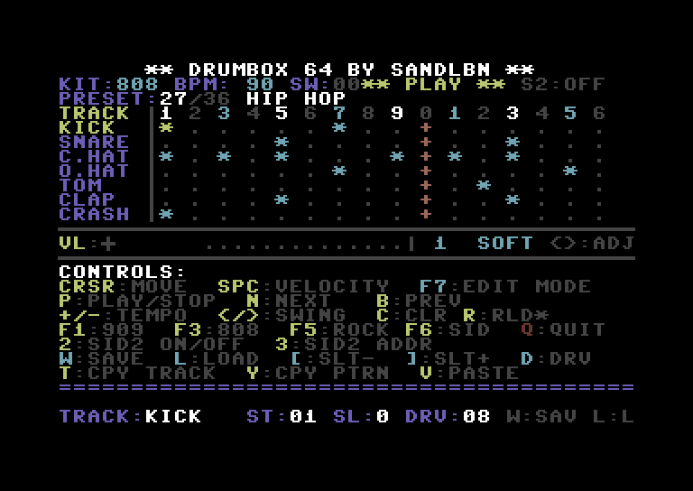

# DRUMBOX 64
A 16-step drum machine for the Commodore 64.

## Note
This is an old project I started years ago and never finished.  
Recently I dusted it off, fixed the issues, and brought it back to a working state.

## Downloads
Get the latest builds here:  
https://github.com/sandlbn/drumbox64/releases/

## Features
- 7 tracks: Kick, Snare, Closed Hat, Open Hat, Tom, Clap, Crash
- 16 steps per track with 4 velocity levels (off / soft / medium / loud)
- 4 drum kits: 909 (punchy electronic), 808 (deep boomy), Rock, SID
- 36 built-in presets including Hip Hop, DnB, Jungle, Metal Thrash (240 BPM) and Blast Beat (250 BPM)
- Swing control (0–99%)
- Dual SID support (4 selectable addresses)
- Save/load patterns to disk (10 slots)
- Joystick support (port 2) with hold-fire edit mode
- Copy/paste: track or full pattern clipboard with scratch buffer

## Screenshot

*DRUMBOX 64 running on Commodore 64*

## Build
Requires the [Oscar64 compiler](https://github.com/drmortalwombat/oscar64).

```sh
oscar64 -o=drumbox.prg -O2 -g \
    main.c sid.c seq.c ui.c presets.c diskio.c -ii=../oscar64/include
```

## Run
```sh
x64sc -autostart drumbox.prg
```

## Controls

### Grid
| Key | Action |
|-----|--------|
| Cursor keys | Move around the grid |
| Space | Cycle step velocity: off → loud → medium → soft → off |
| P | Play / Stop |
| N / B | Next / Previous preset (keeps your edits) |
| + / - | Tempo ±2 BPM |
| < / > | Swing ±4% |
| C | Clear pattern |
| R | Reload preset from ROM (discards edits) |
| F1 / F3 / F5 / F6 | Kit: 909 / 808 / Rock / SID |
| Q | Quit to BASIC |

### Copy / Paste
| Key | Action |
|-----|--------|
| T | Copy current track row |
| Y | Copy full pattern (all 7 tracks) |
| V | Paste |

Clipboard status shown on preset line as `[CPY:TRK]` or `[CPY:PAT]`.  
Edits survive N/B browsing via a scratch buffer — one slot at a time. Save with W before editing a second slot.

### Edit Mode
Press **F7** or hold joystick fire (~1 second) to enter edit mode.

| Control | Action |
|---------|--------|
| F7 | Toggle edit mode |
| Joystick U/D | Switch between Swing and Velocity rows |
| Joystick L/R | Adjust value |
| Joystick fire | Exit |

### SID
| Key | Action |
|-----|--------|
| 2 | Toggle dual SID on/off |
| 3 | Cycle SID2 address (DE00 / DF00 / D500 / D420) |

### Disk I/O
| Key | Action |
|-----|--------|
| W | Save pattern to current slot |
| L | Load pattern from current slot |
| [ / ] | Previous / Next slot (0–9) |
| D | Cycle drive number (8–12) |

Patterns saved as `DBOX0`–`DBOX9`.

### Joystick (port 2)
- **Directional**: move cursor
- **Short fire**: cycle step velocity
- **Hold fire ~1 sec**: enter edit mode
- **Fire in edit mode**: exit

## Kits

| Kit | Key | Character |
|-----|-----|-----------|
| 909 | F1 | Punchy electronic — TR-909 style |
| 808 | F3 | Deep boomy — TR-808 style |
| Rock | F5 | Just rock and pure metal chaos|
| SID | F6 | Pure C64 game music :P maybe|

## Timing
- CIA2 Timer B at 240Hz PAL
- BPM range: 40–280
- Swing: 0–99%